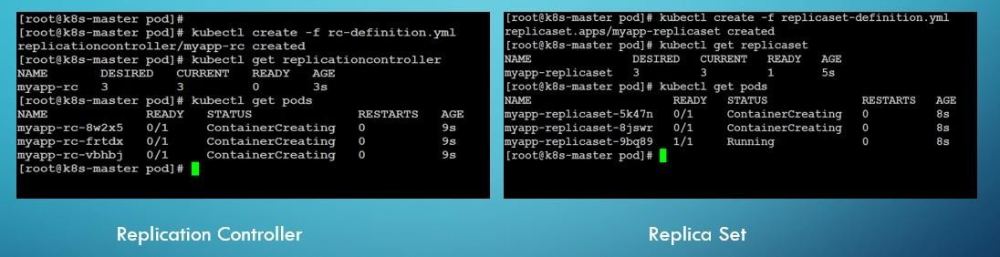

### Introduction:
- Good Moring, Thank you for shortlisting for the interview
- I am Vinod I am from Hyderabad.
- I have around 6 years of experience in software development, (Recently I released from the project) currently I’m working as a DevOps Engineer for one of the healthcare project as a part of Truven Health(merative)
- I have done my B.Tech from DBS Institute of Technology with the specialization in Electronics and communications Engineering
- Currently I am looking for an opportunity to work with an innovative company like yours. That’s all from me thank you.

#### Roles and Responsibilities
- Used to create the CI/CD pipelines by using Jenkins weather it is continuous deployment and continuous delivery.
- We have some environments in the project such as DEV, STAGE, (TEST, PRE-PROD) and PROD. I use to deploy the (CommOps) applications based on the requirement into these feature environments.
- Worked with some automation process for Artifactory by using groovy script
- We used to create an Ansible playbooks and roles for application deployments or installing the packages in remote server.
- Worked with the IBM Cloud, we have some custom toolchain are created for deployment process to each environment (DEV, STAGE and PROD).
- We used to deploy the applications into the Azure kubernetes services. 
- We use to resolve the issues which we face while deployment
- Worked with the terraform to provision the infrastructure.
- Upgrading the kubernetes cluster by using the terraform for all CommOps tools.
- Creating the Active Directory Groups for the user in Azure Active Directory
- Having experience on SonarQube.
- Having experience in Release Management.
- Worked with the Pager Duty in order to resolve the issues.

---
 
## JENKINS:

### 1.	What is Jenkins?
Ans: Jenkins is an open-source automation tool. Which is used to build for Continuous Integration purposes. Jenkins is used to build and test your software projects continuously making it easier for developers to integrate changes to the project, and making it easier for users to obtain a fresh build. It also allows you to continuously deliver your software by integrating with a large number of testing and deployment technologies.
### 2.	What are the other tools for CI/CD?
Ans: Buddy, Jenkins, TeamCity, Bamboo, Gitlab CI, Integrity etc.
Buddy: is a smart CI/CD tool for web developers designed to lower the entry threshold to DevOps. It uses delivery pipelines to build, test and deploy software.
### 3.	What is the use of GitHub WebHook?
Ans: As soon as we commit any change in git to the particular branch, it will automatically triggers in to the Jenkins. This is known as git hub WebHook.
### 4.	How to configure WebHook?
Ans: Goto repository in git that you want to configure in jenkins->click on settings icon->click on WebHook at left side panel->click on add WebHook->enter the payload URL(Jenkins URL ex: 12.234.56:8080/github-webhook/)->change the content type Json->click on Add webhook button.
### 5.	What is Difference between Continuous Deployment and Continuous Delivery?
Ans: 

**Continuous Deployment:** For example we have an environment called DEV assume that this is our destination. Suppose the code pull from git to Jenkins here it compiled by maven. 

Later it gets created Docker Image or docker container and It move or deploy automatically to the DEV environment this process is known as deployment. Up to here not required any Manuel intervention this process is known as Continuous Deployment.

**Continuous Delivery:** For example we have an environment called PROD (Production) assume that this is our destination. Suppose the code pull from git to Jenkins here it compiled by maven later it gets created Docker Image or docker container and It move or deploy to the PROD environment by the Manuel approval from the manger or higher authority or client then we can trigger the delivery job, then only it moved to the PROD this is known as Continuous Delivery. Here manual intervention (Manager, client, or lead) is required.
*	Max UAT and Prod we need to follow the continuous delivery. And DEV and PT follows continuous deployment
*	Dev: Development Environment (Code)
*	PT: Performance Testing (For Testing)
*	UAT: User Acceptance Testing (Client)
*	Prod: Production Environment 
### 6.	What is the SSH port number?
Ans: SSH (Secure Shell or Secure Socket Shell) port is used to Communication between one servers to another server.
*	SSH Port Number is: 22
### 7.	How to manage Private Plugins?
Ans: Goto->Manage Jenkins->Manage Plugins->click on advanced tab->scroll down, there you can find the Upload Plugin option, there we can choose the plug-in file and upload it.
### 8.	How many executors we can run in the node?
Ans: While we create the Slave node, there is an option called no of executers. Here we define the required no.of executers. For Example if you define 5. So at a time 5 pipelines or concurrent builds will run. So we can give as for our requirement.
### 9.	What is the process to connect between Master node to Slave Nodes?
Ans: Goto Manage Jenkins->click on Manage Nodes->select New Node->Enetr the name of the node->selet Permanent Agent->click OK->Enter the hostname in the Host field->select Add button to add credentials and click Jenkins.->enter Username, Password, ID, and Description.->Select the dropdown menu to add credentials in the Credentials field.->Select the next dropdown to add the Host Key Verification Strategy under Non verifying Verification Strategy.->Select Keep this agent online as much as possible in the Availability field.->Click Save Button.
### 10.	How to configure the Node?
Ans: Go to manage Jenkins->manage nodes->click on node->click on Configure Node option. Here we can configure the node.
### 11.	How to do safe restart the Jenkins?
Ans: By using the “prepare for shutdown” option we can do safe restart the Jenkins. Here we need to define the Shutdown reason.
### 12.	Difference between Restart and Safe Restart in Jenkins?
Ans: Restart: If we give at the URL “ipaddress:Jenkins_port_number/restart”	It restarts
the Jenkins even the pipelines are running it cancels all the pipelines. And restarts the Jenkins.

`Ex: 44.201.216.47:8080/restart`

- If we run the Jenkins as service in the server we can restart the jenkins by the command,
```bash
“systemctl restart jenkins”
```
`Safe Restart:` Here we use” prepare for shut down “option by defining the shutdown reason in Jenkins, it waits until all the pipelines are finished then it restarts the Jenkins.
### 13.	What is the use of Reload Configuration from Disk in Jenkins? 
Ans: Here all the jobs will reload to the Jenkins UI by using the Reload Configuration from disk option even after we delete the jobs.
### 14.	What is the use of workspace?
Ans: Every time we create the job and build the job, workspace got created. In workspace all the files that are related the application will be available.
### 15.	What is the use of global tool Configuration in Jenkins?
Ans: If we want to integrate the Jenkins to some other tools like Gradle, Ant, Maven, and Git we use the Global Tool Configuration option in Jenkins.
Suppose if you want to integrate the Maven to Jenkins, Maven installed in some other server so we need to add the Maven path at the Jenkins under the Global Tool Configuration option.
### 16.	How to configure the single sign-in (only one username and password) option for all services?
Ans: By using LDAP (Lightweight Directory Access Protocol) we can configure the single sign in option. By using the same credentials we can sign in all the tools and services that we have access.
### 17.	Where we configure the LDAP in Jenkins?
Ans: Go to manage Jenkins->Configure Global Security.
### 18.	Difference between scripted pipeline and declarative pipeline?
Ans: Declarative pipelines: It break down stages into individual stages that can contain multiple steps.
Scripted pipelines: It use Groovy code and references to the Jenkins pipeline DSL within the stage elements without the need for steps.
### Ex: 
```groovy
node('master') { 
    
    stage('Say Hello') { 
        
    echo 'Hello World'
``}
}
```
### 19.	What are the stages in Jenkins pipeline?
Ans:
```groovy

pipeline{
agent any 

stages{
    stage('Build'){ 
    steps {
echo ‘This is Building Stage’ 
}
}
stage('Test'){
steps {
echo ‘This is Test Stage’
}
}
stage('Deploy'){
steps {
echo ‘This is Deploy Stage’
}
}
stage('Monitor'){
steps {
echo ‘This is Monitor Stage’
}
}
}
}
```
### 20.	What is the meaning of execute concurrent builds?
Ans: Suppose if you add the file in git that is already building in the Jenkins. And again if you commit something in the same file that won’t run until enable this option called execute concurrent builds. Because already previous build is running. So after completing the previous build then only it will build.
### 21.	What is throttle builds?
Ans: This way, the pipeline that would be able to run several builds at the same time, with some "upper limit" on how many builds.
### 22.	What is GitHub hook trigger for GITScm polling?
Ans: By enabling this option every time we commit the changes in git that will trigger and build the pipeline that we configured in the Jenkins.
To Configure this,
*	Goto Jenkins Dash board->click on job that you created->In general tab->Source Code Management Tab->select Git->add Repository path->specify the branch name(Ex: main or master)->Enable the Github hook trigger for GitScm polling option->click on apply and save.
### 23.	Difference between poll SCM and GitHub hook? 
Ans: In Poll Scm, we schedule the time (H/15***) but here it checks the git repository for every 15 minutes if any new commit is available or not. If commit is there it builds the pipeline otherwise it will’nt build.
GitHub Hook: By enabling this option every time we commit the changes in git that will trigger and build the pipeline that we configured in the Jenkins.
### 24.	Difference between poll SCM and build periodically?
Ans: In build periodically it builds the pipeline based on time intervals. So it fetch the code from Git and builds as per the scheduled timings by using the cron job.
`Ex: H/15*day*month*year.` So here for every 15minits it trigger and builds the pipeline even if there is no new commit.
In Poll Scm, we schedule the time (H/15***) but here it checks the git repository for every 15 minutes if any new commit is available or not. If commit is there it builds otherwise it will’nt build
### 25.	How to change the Jenkins port in tomcat server?
Ans: Step1: java –jar Jenkins. War –httpPort-8080(Here we can change the port number ex. 8082, 8083)
Step2: Whenever we install the Jenkins In tomcat server there we have server.xml file, here we have a parameter called connector port there we change the Jenkins port number.
* By default Jenkins port number is 8080
### 26.	How to restart the Jenkins?
Ans: In the URL we just give the ‘/restart’ beside the server ip and Jenkins port. Ex. 34.209.88.191:8080/restart
### 27.	How to secure the Jenkins?
Ans: Go to->Manage-Jenkins->Configure Global Security->under Security Realm select Jenkins own user database->select checkbox select Allow user to sign up or LDAP
Go to Authorization -> project based matrix authorization strategy we give the permissions to the user.
### 28.	Why do we need to configure Jenkins slave nodes?
Ans: If you want to perform the building and testing the application regularly we need to create the Jenkins slave nodes and we run the building in that nodes.

If we have multiple pipelines or jobs, one Jenkins master node cannot manage the job. So in order to increase the performance we create the slave nodes and we give the slave node label name in build configuration. Then that particular build will run in that slave node.
### 29.	How to configure the Nodes in Jenkins?
Ans: Manage-Jenkins->Nodes->New Node->give the node name->select permanent agent->0k
Name of the node, no.of executors, remote directory, labels, Launch method based on these details we configure the Jenkins nodes. 
### 30.	What are the plugins do you used in Jenkins?
Ans: 

**1. Git Plugin:** To interact with Git.

**2. Rebuilder:** whenever we build the Jenkins pipeline we we give some choice parameters. If you face any issue while building. If you want to run the failed builds with same parameters we use the Rebuilder plugins.

**3. Job Configuration History Plugin:** If you do the changes in pipeline or job configuration all the changes are available by installing the Job Configuration plugin.

**4. ThinBackup :** By using tis plugin we can back up the Jenkins as per the schedule. By using the cronjob we can schedule.

**5. SSH:** This plug in used to execute the commands remotely.

**6. Greenball plugin:** This plug-in is an user interface for build success or failed

**7. Parameterized trigger plugin:** This plugin is used to trigger the second job after first job executed. Here first job is called upstream project second job is called Downstream project.

**8. HTML Publisher:** This plugin publish HTML reports.

### 31.	What is Jenkins Home directory?
Ans: 
`/var/jenkins_home`
- The Jenkins home directory consist of all the information about jobs, nodes, plugins, users, workspace, secrets etc.
### 32.	How many executers can we execute in the server?
Ans: By Default 2 executers, after that we can use as per our requirement. If you have 2 executers at a time, these two pipelines will run first and rest of the pipelines are in waiting state till the first 2 pipeline are complete.
### 33.	How to change the Jenkins users password?
Ans: `Goto->manage jenkins->manage users->click on user name ->click on configure`
### 34.	Where you can find the Jenkins version?
Ans: Go to manage-Jenkins->About Jenkins->(About Jenkins 2.319.1) Here we can find The Jenkins version.
### 35.	What is prepare for shutdown option in Jenkins (or) difference between restart and safe restart?
Ans: Prepare for shutdown: If you use this option it waits until the current jobs or pipelines are completed, then Jenkins will shut down. If you give the shutdown option in URL it shut down immediately even the pipelines are running.
### 36.	What is Global Tool Configuration in Jenkins?
Ans: Here we configure all the tools like git, maven, jdk tools paths in jenkins. 
### 37.	How to create the job in Jenkins?
Ans: click on New Item->Enter the item name->choose freestyle project->Ok
### 38.	What are the different types of projects available in the jenkins and explain?
Ans: Free Style, Pipeline, Multi-configuration project, Folder, Multibranch pipeline, Organization folder.

**Free Style:** Every build system like Maven, Ant the free style project will integrate to the SCM (git/svn).

**Folder:** Here we create the folder for each environment and create the jobs into that folder. Ex: DEV, PT, PRE-PROD and PROD

**Multibrnach Pipeline:** While we create the branch in git, that branch will trigger to Jenkins pipeline automatically.

**Pipeline:** By choose this project we need to define the pipeline stages by using declarative pipeline and scripted pipeline. We basically use the declarative pipeline

`Ex: `

```groovy
pipeline {
Agent any stages {
stage(“Hello”) {
stage {
echo “Hello World”
}
}
}
```
* Pipeline script from SCM in drop down means we already define the pipeline script and stored in the Git/SVN from that only we can pull the code.
* Generally we use Freestyle Project.
### 39.	How to configure the Job in Jenkins?
Ans: 
Select the Job-> *Go to general Tab, Execute the concurrent builds—Need to explain to the interviewer
- Source code management tab, Git
- Build Triggers—here we choose the build options Build after other projects are build 
- Build Periodically
- GitHub hook trigger for GitScm polling Poll SCM 
- Add Build Actions in Build Environment Tab
- Click Apply and Save
### 40.	Write the Jenkins pipeline file and explain its stages?
### 41.	Jenkins installation using Ansible?
----check the harish shared link for reference in skype----

---

## MAVEN

### 1.	What is the local repository in Maven?
Ans: 

**Local Repository:** If you define the any plugin in POM.XML file that plug-in will install in local repository while building. Second time if you building the application it checks in the local repository weather the plug in is available or not.

- “.m2” is the local repository in maven.
### 2.	Difference between local repository and remote repository?
Ans: 

**Local Repository:** If you define the any plugin in POM.XML file that plug-in will install in local repository while building. Second time if you building the application it checks in the local repository weather the plug in is available or not.

- “.m2” is the local repository in maven.

**Remote Repository:** Here Developers will creates their own or custom repository, they store the dependencies or plug-ins and project related files in that repository. So while we building the application it checks the central repo if not available it downloads and install from remote repository.

### 3.	Difference between central repository and remote repository?
Ans: 

**Central Repository:** If the plug in is not available in maven local repository it downloads from the central repository (Google) through the internet access and stores in the local repository

**Remote Repository:** Here Developers will creates their own or custom repository, they store the dependencies or plug-ins and project related files in that repository. So while we building the application it checks the central repo if not available it downloads and install from remote repository. 

### 4.	What are the repositories available in the Maven?
Ans: local, central and remote repositories.
### 5.	What is Mean by Artifacts?
Ans: All project related files are nothing but arttifacts.project design and project structure jar and war, ear files.
### 6.	What are the three important parameters in POM.xml file (Project Object Model)? Ans: Group ID, Artifact ID, and Packaging?

**Packaging:** Here we define the final output package format like (JAR/WAR/EAR). Group ID: here we define the reverse organization name (Ex: com.myApp.app) Artifact ID: Here we define our application name (Ex: myApp).

- Finally it creates like “myApp.jar”
### 7.	Difference between SNAPSHOT and version in POM.XML?
Ans: 
```xml
<version>1.0-SNAPSHOT</version> --- It means this particular version is in under development stage. 
```
- Currently it is in testing stage. Once the testing was done we remove the SNAPSHOT. And finally we give the stable version number like “1.0” .
`Version:` Stable release version

`SNAPSHOT:` under development or testing version.

### 8.	How to list the hidden files in git?
Ans: ls –a
### 9.	What is the local repository in maven? Ans: .m2
### 10.	What are the plugins that you used in maven?
Ans: maven-compiler-plugin, maven-sure-fire-plugin, maven install plug-in, maven deployment plug-in, exec-maven-plugin, maven-dependency-plugin, maven-resources-plugin
### 11.	What is maven sure-fire plugin?
Ans: To compile any unit test files we used the plugin called Maven-surefire-plugin.
### 12.	What is maven?
Ans : maven is a build tool
### 13.	What is maven life cycle?
Ans: First need to compile, run the unit tests, JAR/WAR files creation, install the JAR/WAR files to the local repository.
### 14.	What is local repository, central repository and remote repository in maven? 
Ans: 

**Local Repository:** If you define the any plugin in POM.XML file that plug-in will install in local repository while building. Second time if you building the application it checks in the local repository weather the plug in is available or not.

**Central Repository:** If the plug in is not available in maven local repository it downloads from the central repository (Google) through the internet access and stores in the local repository

**Remote Repository:** Here Developers will creates their own or custom repository, they store the dependencies or plug-ins and project related files in that repository. So while we building the application it checks the central repo if not available it downloads and install from remote repository.

### 15.	What is Parent POM and Child POM.XML?
Ans: Here we can’t define all the plug-ins that are related to the project so that we create the parent POM and Child Pom.xml files.
- In Parent Pom we define necessary plugins dependencies
- In Child POM we define the application related micro services. In child POM we need to define the Parent POM Name (ArtifactId), Version, Group Id. Whenever we run the application Child POM connects to Parent POM and it install the plugins.

---


## DOCKER

### 1.	What is Docker, Docker image and Docker container?
Ans: Docker is a container platform. We can create the containers by using docker.

**Docker Image:** Docker Image contains operating system (windows/Linux), and its system files and all related information will be available in the Docker image

**Docker Container:** Docker container is a running instance of the Docker image, whenever we run the docker image the container will be created.

### 2.	What are the Docker client commands?
Ans: docker pull, docker push, docker run, docker build

**Docker pull:** If you give this command image will be download from the Docker hub. Docker push: If you give this command image will be push to the Docker hub.

**Docker run:** If you give this command container will be created.

* docker –-help : You will find the all information and commands about the service

### 3.	How to enter into the Docker container?
Ans: by using exec or attach commands we can enter into the container
### 4.	Difference between docker engine and docker hub?
Ans: 

**Docker Engine:** Docker 

**Docker Hub:** It is the web based location of storing the all Docker Images (or) Docker Hub is Docker’s official cloud-based registry for Docker images.

**Docker Registry:** A Docker registry is a service that hosts and distributes Docker images.
In many cases, a registry will consist of multiple repositories which contain images related to a specific project.

### 5.	How to store the container changes into the Image?
Ans: by using docker commit command
Ex: docker commit container-id image-name
### 6.	I have a Docker image I want to move the docker image to another server but I don’t want to using “copy command” to move the image into the server then what is the process to move the docker image to another server?
Ans: Here we move the docker image as Zip file by using save command.
```bash
docker save image-name > zip_file	//Here image is moved to the Zip file
```
`Step2:` copy the Zip-file to the another server and type the “docker load” command in that server.
```bash
docker load zip-file //Here the image will load from the zip-file into the server
```
#### Docker commands:
### 7.	How to list the docker running container?
Ans: 
```bash
docker ps	//Only for running container
Docker ps –a //it shows all the containers including stopped containers
```

### 8.	Rename the container?
Ans: 
- docker rename old-container-name new-name Restart the Container: Restart the container
```bash
docker restart container-id Docker rm : remove the contaniers Ex: docker rm container-id
```
`Docker rmi:` remove the docker images Ex: docker rmi image-id

`Note:` if you want to remove the container we need to stop the container first and remove To stop the container : 
```bash
docker stop container-id
```
- To start the container : 
```bash
docker start container-id
```
- To display live stream of container resource usage statistics “stats” 
```bash
docker stats container-id //It shows the containers CPU and Memory utilization information
```
`Docker build:` This command is used to create the custom image from the docker file .

`Docker exec:` to enter into the container we use the command “docker exec”.

### 9.	Which version of Docker are you using?
Ans: Ex: 20.10.7
### 10.	How to search the Image?
Ans: Ex: docker search nginx
### 11.	How to update the resource in container?
Ans: By using docker update
### 12.	What are the types of networks available in docker?
Ans: bridge, host and none. By default it uses the bridge network while we run the docker image.

**Bridge network:** Suppose if you need to communicate between one networks to another network we use the bridge network. Here a container is equals to an individual server. The connection between one container to another container will work based on the bridhe network.
- In bridge network each and every container is isolate or individual. Each container will have an IP address and have an network interface.

```bash
docker network create my_bridge_network
docker run --network=my_bridge_network -d my_image
```
**None Network:** In this network there no network. If you run the container under this none network it does not provide any IP address to the container. So it does not communicate with other containers.

```bash
docker run --network=none -d my_image
```

**Host Network:** In Host Network, IP address and network interface will not create for the container, by using the host network (server) the container will run.

```bash
docker run --network=host -d my_image
```
- Command for Run the container on Particular Network,

```bash
docker run –itd –name nginx-container –p 8082:80 nginx –network host.
```
### 13.	Difference between docker and kubernetes?
Ans: Docker is used for containerization purpose. Kubernetes is used to manage the containers
Docker is a container platform. We can create the containers by using docker. Kubernetes is a container management system 
### 14.	Difference between Virtual Machine and Docker? 

Ans: 

#### Differences between Docker and	Virtual Machine
#### Operating system	
#### Docker
1.	Docker is a container-based model where containers are software packages used for executing an application on any operating system
2.	In Docker, the containers share the host OS kernel
3.	Here, multiple workloads can run on a single OS	

#### Virtual Machine
1.	It is not a container-based model; they use user space along with the kernel space of an OS
2.	It does not share the host kernel
3.	Each workload needs a complete OS or hypervisor

#### Performance
#### dOCKER	
1.	Docker containers result in
high-performance as they use the same operating system with no additional software (like hypervisor)
2.	Docker containers can start up quickly and result in less boot-up time	

#### Virtual Machine
1.	Since VM uses a separate OS; it causes more resources to be used
2.	Virtual machines don’t start quickly and lead to poor performance


#### Speed	

The application in Docker containers starts with no delay since the OS is already up and running	It takes a much longer time than it takes for a container to run applications
To deploy a single application, Virtual Machines
 
These containers were	need to start the entire OS,
basically designed to save	which would cause a full boot
time in the deployment	process
process of an application	


### 15.	Difference between Docker and Docker compose? Ans:
When working with Docker, there are two concepts: Image and Container. Images are like mini operating systems stored in a file which is built specifically with our application in mind. Think of it like a custom operating system which is sitting on your hard disk when your computer is switched off.
Containers are running instances of your image.

Docker is the underlying technology which manages (creates, stores or shares) images, and runs containers.
We provide the Dockerfile to tell Docker how to create our images. For example, we say: starts from the Python 3 base image, then install these requirements, then creates these folders, then switch to this user, etc… (I’m oversimplifying the actual steps, but this is just to explain the point).

Once we have done that, we can create an image using Docker, by running docker build .. If you run that, Docker will execute each step in our Dockerfile and store the result as an image on the system.
Once the image is build, you can run it manually using something like this:

```bash
docker run <IMAGE_ID>
```
- However, if you need to setup volumes, you need to run them like this:

```docker
Docker run -v /path/to/vol:/path/to/vol -p 8000:8000 <IMAGE_ID>
```
Often applications need multiple images to run. For example, you might have an application and a database, and you may also need to setup networks and shared volumes between them.

So you would need to write the above commands with the appropriate configurations and ID’s for each container you want to run, every time you want to start your service…

As you might expect, this could become complex, tedious and difficult to manage very quickly…

This is where Docker Compose comes in…

Docker Compose is a tool used to define how Docker runs our images in a yaml file which is can be stored with our code and reused. 
So, if we need to run our app image as a container, share port 8000 and map a volume, we can do this:
```bash
services:
app:
build:
context: . ports:
- 8000:8000
volumes:
- app/:/app
```

- Then, every time we need to start our app, we just run docker-compose up, and Docker Compose will handle all the complex docker commands behind the scenes.

- So basically, the purpose of Docker Compose is to configure how our running service should work together to serve our application.

- When we run docker-compose build, Docker Compose will run all the necessary docker build commands, to build all images needed for our project and tag them appropriately to keep track of them in the system.

In summary, Docker is the underlying technology used to create images and run them as containers, and Docker Compose is a tool that configures how Docker should run multiple containers to serve our application.
### 16.	Difference between Docker compose and Kubernetes?
Ans: 

#### Docker Compose vs Kubernetes: What are the differences?
#### What is Docker Compose

Define and run multi-container applications with Docker. With Compose, you define a multi-container application in a single file, then spin your application up in a single command which does everything that needs to be done to get it running.

#### What is Kubernetes? 
Manage a cluster of containers as a single system to accelerate Dev and simplify Ops. Kubernetes is an open source orchestration system for Docker containers. It handles scheduling onto nodes in a compute cluster and actively manages workloads to ensure that their state matches the users declared intentions.

`(Or)`

**docker-compose:** is a tool that takes a YAML file which describes your multi-container application and helps you create, start/stop, remove all those containers without having to type multiple docker ... commands for each container.

**Kubernetes:** is a platform for managing containerized workloads and services that facilitates both declarative configuration and automation.

`(Or)`

#### Docker Compose 
Docker Compose is a tool for defining and running multi-container Docker applications. With Compose, you use a YAML file to configure your application’s services. Then, with a single command, you create and start all the services from your configuration. Compose has commands for managing the whole lifecycle of your application:
- Start, stop, and rebuild services
- View the status of running services
- Stream the log output of running services
- Run a one-off command on a service
#### Kubernetes

Kubernetes is a container orchestrator tool like Docker Swarm, Amazon ECS, Hashicorp Nomad. Container orchestrators are the tools which group hosts together to form a cluster, and help us make sure applications: are

- fault-tolerant,
- can scale, and do this on-demand
- use resources optimally
- can discover other applications automatically, and communicate with each other
- are accessible from the external world
- can update/rollback without any downtime.
### 17.	How to display the running containers in docker?
Ans: docker ps
### 18.	How to display the stopped and running containers in Docker?
Ans: docker ps –a
by using ctrl+pq we come out from the container it runs in the backend. If you type exit. It stops the container and exist.
### 19.	What is the use of inspect command in docker?
Ans: Ans: To get the detailed information about one or more networks, image and container. We use the command below,

```bash
docker inspect Network Bridge
```
### 20.	Difference between Copy and Add command in docker file?
Ans: COPY: If you want to copy the particular files to docker image or container we use the COPY command. Here we need to define the source and destination.

```bash
OPY /etc/hosts/opt/	//here /etc is our source path /opt is destination (server) path.
```
By using this copy command we can copy the files and directories. It is just copy purpose
ADD: This command is also used to copy the files and directories but here by using ADD command if you give the zip file, this zip file will extract in the container automatically. 

Suppose if you give a path or location of the zip file from the remote, the ADD command will download and keep it in the container. It download and extract the remote URLs.
### 21.	Difference between CMD and ENTRYPOINT in Docker file? Ans: CMD/ENTRYPOINT
CMD: Suppose if I want to give some message to the docker image ex: echo “this image is for dev”.So while we build the docker image we can overwrite the message that we defined already. Ex: echo “this image is for Test”.

`ENTRYPOINT:` Here we cannot overwrite but we can append the message if you use the ENTRYPOINT command

### 22.	How to build the Docker file that are defined in another location?
Ans: docker build –t image-name –f file-name file-path
### 23.	How to check the properties in Linux System?
Ans: df -h
### 24.	What is the use of “prune” command in docker volumes?
Ans: ex: docker image prune //It deletes all unused volumes
### 25.	Difference between “p” and “P”?

### 26.	What is docker file?
Ans: The file which is having list of instructions, by using this instructions we create the custom image. That image consists of all the files that are related to the application. As soon as we run that docker image container will create
Some of the instructions in docker file, FROM
MAINTAINER RUN, COPY ADD
CMD/ENTRYPOINT ENV

`FROM:` From instruction is used to get the base image from the registery or docker hub. If we want to create the custom image we need one base image that was get by the FROM instruction.
Ex: 
```Dockerfile
FROM nginx
MAINTAINER: Maintainer is an user or author name that name can be any (Ex:vinod)
RUN: Run instruction is used to install any package. Ex: RUN yum install httpd -y 
COPY: If you want to copy the particular files to docker image or container we use the COPY command. Here we need to define the source and destination.
```

```bash
COPY /etc/hosts/opt/	//here /etc is our source path /opt is destination (server) path.
```
- By using this copy command we can copy the files and directories. It is just copy purpose

`ADD:` This command is also used to copy the files and directories but here by using ADD command if you give the zip file, this zip file will extract in the container automatically.
Suppose if you give a path or location of the zip file from the remote, the ADD command will download and keep it in the container. It download and extract the remote URLs
#### CMD/ENTRYPOINT

**CMD:** Suppose if I want to give some message to the docker image ex: echo “this image is for dev”.So while we build the docker image we can overwrite the message that we defined already. Ex: echo “this image is for Test”.

**ENTRYPOINT:** Here we cannot overwrite but we can append the message if you use the ENTRYPOINT command

**ENV:** Here we define the environmental variables.

- Dockerfile Example FROM nginx MAINTAINER vinod COPY testfile /opt/testfile
- ENTRYPOINT [“echo”, “hello”] CMD [“image”]
### 23. What is the use of docker volumes?
Ans: Suppose we have container we install the application in the container so here all the data that is related to the application will store in the container.

- So after sometime if you delete the container all the application data will be deleted but we need that data from the container. We required the data if all application data gets deleted we need to start from the beginning.
- In order to overcome this problem we use Volumes in docker.
- While we creating the containers we create the volume to store those container data by specifying the container path.(Ex: /etc/var). So here the data which is present in the container will store into the volumes.
- The data will sync between container and volumes
- After if you delete the container. The data will remain safe in the volume. That’s the reason why we use the volumes in docker
- By using the Bind Mount we can move the data from the container to directory. We assign the directory to the container. So all the container data will move to the directory.mostly we use docker volumes.
- we can assign the same volume to the different containers 
Create the Docker Volume

```bash
docker run –itd –name jenkins1 –v volume1:/var/jenkins_home –p 8081:8080 jenkins/jenkins:lts.
```
- We never modify the volume data. We always interact with the container data.

---

## AWS (AMAZON WEB SERVICES):

### 1.	How to secure the IAM in AWS?
Ans: Under the Account Information-> Click on Security Credentials we have some options below,

`Step 1:` We enabling MFA (Multifactor Authentication)
- MFA (Multi Factor Authentication): MFA works by requiring additional verification information (factors). One of the most common MFA factors that users encounter are
- one-time passwords (OTP). OTPs are those 4-8 digit codes that you often receive via email, SMS or some sort of mobile app.
* While we login the IAM account it asks to enter MFA code along with username and password.
### 2.	What are the Storage class available in AWS?
- The S3 storage classes include
- `S3 Standard` for frequently accessed data, if you create the s3 bucket in AWS it will create under S3 Standard frequent access by default. It creates the object in multiple Zones.

- `S3 Standard-Infrequent Access` (S3 Standard-IA) If you don’t want to access the data frequently we use this Standard-Infrequent Access storage class. It creates the object in multiple Zones

- `S3 Intelligent-Tiering` for automatic cost savings for data with unknown or changing access patterns. It is commination both standard and standard IA. If the user accessing the data frequently it moves to the Standard Storage class. It creates the object in multiple Zones
- If the user is not accessing the data frequently it moves to the Standard In frequent Storage class. These operations are managed by the S3 Intelligent Tiering.
- `S3 One Zone-Infrequent Access` (S3 One Zone-IA) for less frequently accessed data. It creates the object in only one Zones.
- `S3 Glacier` Instant Retrieval for archive data that needs immediate access,
- `S3 Glacier Flexible Retrieval` (formerly S3 Glacier) for rarely accessed long-term data that does not require immediate access.
- `S3 Glacier Deep Archive` (S3 Glacier Deep Archive) for long-term archive and digital preservation with retrieval in hours at the lowest cost storage in the cloud. It compress the data. For retrieval data takes the long time
### 3.	What is Intelligent Storage class? 
Ans: Amazon S3 Intelligent-Tiering (S3 Intelligent-Tiering) is the first cloud storage that automatically reduces your storage costs on a granular object level by automatically moving data to the most cost-effective access tier based on access frequency, without performance impact, retrieval fees, or operational overhead.

S3 Intelligent-Tiering delivers milliseconds latency and high throughput performance for frequently, infrequently, and rarely accessed data in the Frequent, Infrequent, and Archive Instant Access tiers. You can use S3 Intelligent-Tiering as the default storage class for virtually any workload, especially data lakes, data analytics, new applications, and
user-generated content.
### 3. What is Replication rules in AWS S3?
Ans: Suppose if you create the s3 bucket in some region (Ex: us-east-1). So if want to send or replicate the same object in another region or another bucket in the same region we use this replication rule.
Click 0n->create replication rule->source bucket->bucket name
### 4.	Does static website hosting supports https in AWS?
Ans: By using Amazon S3 bucket we can create the Static Website hosting. But https is not support
### 5.	How to select the availability zone in subnet while launching the instance?
Ans: By default instance picks the existing subnets zone.
### 6.	If you launch instance in public and private IP’s in the subnet respectively. After stop and again start the instance does new IP’s are created or old IP’s are exist?
Ans: Here Private IP doesn’t change. Only public IP gets change. This is only if you stop the instance .But if you reboot the instance both IP’s will not change.
IAM (Identity and Access Management)
### 7.	What is role in IAM?
Ans: Role is nothing but group of policies. We can attach many policies to the single role and give the access to the services and finally we attach this role to the particular user. That user can have access to the services that we attached.
*	Instead of accessing the services directly by the user we create the Role to interact with these services. Suppose I want to call the S3 buckets by using EC2 instance. Now we create the role and assign to the instance.
*	While we create the EC2 instance we can select the role under IAM role option.
*	Generally we can’t pass the Access key and secret key directly we always use the role to access the services.
### 8. What are the types of policies in AWS?
Ans: In AWS we have Managed Policies, custom policy and In-line policy.
*	Managed Policies are managed by the AWS. These policies are already created we cannot edit or modify these policies
*	Custom-Policies are designed by the user or developer by using AWS policy generator. 
*	**In-line policy:** Here we create the policy for the particular user or group. It is applicable only for that user or group.
### 9.	Difference between role and policy?
Ans: Answer already written above.
### 10. What is policy in IAM?
Ans: Policy is nothing but permissions.
### 11.	What is account settings in IAM?
Ans: Here we can do the settings Password Policy of the user.
### 12.	What is In-Line policy and managed policy? Ans: Answer already written above.
### 13.	What is cross account access (or) Assume role?
Ans: cross account access is, If the developer want to access the data from one account to another account, in second account we create one role and this role ARN we will give at the first account user after creating the In-line policy and define that ARN. This all process will be perform based on assume role. This assume role is managed by STS (simple Token Service) at the backend.
### 14.	What is IAM in AWS?
Ans: IAM is the centralized system to manage access for all the services in AWS. IAM is global specific.
#### 15.	What is Account Alias in IAM?
Ans: Here we can get the sign-in URL for IAM user in the AWS account. Here we can create the username instead of account ID.
### 16.	How to change the password policy in IAM?
Ans: Under IAM we have an option called Account Setting, here we can give the password policy to the user.
### 17.	What is cloud watch in AWS?
Ans: Cloud Watch is the Monitoring service for all AWS services. As soon as we enable this cloud watch to any service, it creates the folder in this folder all the logs will be available.
- Cloud Watch is used for monitoring purpose in AWS. It monitor all the services whenever we create or launch the services we need to enable the Cloud Watch.
- While we enabling the Cloud watch we need to define that weather it is basic monitoring or Detailed Monitoring.
CloudFront Distribution.
### 18.	What is cloudFront?
Ans: Cloud front distribution is a content delivery network. It delivers the data or content to the user without latency. 
- Suppose our application data is available in s3 bucket, now the user is trying to get the data but the user doesn’t hit the S3 bucket directly in between the service will run.
- We have an Edge Location in cloud front. Suppose as soon as the user trying to hit our application from US location he get the data nearest location to the US that is called Edge location. So as soon as the user hit the application at beginning no data at the Edge location. 

In the first request the CloudFront will fetch the data from the S3 and keep it in the Edge Location.
Second time if the user hits the same data it will get from the Edge Location. So now we will get the data without latency.
### 19.	What is edge location?
Ans: We have an Edge Location in cloud front. Suppose as soon as the user trying to hit our application from US location he get the data nearest location to the US that is called Edge location.

### 20.	What is Origin Access Identity (OAI)?
Ans: While creating the cloudFront distribution, under S3 bucket permissions a permission will be enabled that is called as Origin Access Identity. This means only this particular CloudFront distribution will access the particular bucket.
### 21.	What is ACM certificates in AWS?
Ans: AWS Certificate Manager (ACM) is designed to simplify and automate many of the tasks traditionally associated with provisioning and managing SSL (Secure Socket Layer)/TLS (Transport Layer Security) certificates. ACM takes care of the complexity surrounding the provisioning, deployment, and renewal of digital certificates for no extra cost!
Rout53
### 22.	What is rout53?
Ans: Route53 is the DNS (Domain Name System) service in Linux. The port number of the DNS is ‘53’. So that we called it as “Route 53” in AWS.
### 23.	What are the different routing policies available in the rout53?
Ans: Simple routing policy – Use for a single resource that performs a given function for your domain, for example, a web server that serves content for the example.com website.
- It is just used for one server to access.
Failover routing policy – Use when you want to configure active-passive failover.

- Here one server is in Active and one server is in back up, if first server is down automatically request goes to second server.

**Geolocation routing policy** – Use when you want to route traffic based on the location of your users. 

**Geoproximity routing policy** – Use when you want to route traffic based on the location of your resources and, optionally, shift traffic from resources in one location to resources in another.
Latency routing policy – Use when you have resources in multiple AWS Regions and you want to route traffic to the Region that provides the best latency with less round-trip time.
- Here, for suppose they create the two servers at us-east-region and Europe region. So if I want to access the application it redirects to the nearby region to avoid the latency
Multivalue answer routing policy – Use when you want Route 53 to respond to DNS queries with up to eight healthy records selected at random.
Weighted routing policy – Use to route traffic to multiple resources in proportions that you specify.
- Here we distribute the traffic to multiple server, suppose we have two servers we assign the traffic 70% to one server and 30% to second server.
S3 (Simple Storage Service)
### 24.	What are the storage classes in s3?
Ans: Standard, standard in frequent, Intelligent Tiering, One Zone IA, Glacier, and deep archive
### 25.	What is the life cycle policy in s3?
Ans: First the file is stored in standard storage class while we create. Later it moves to the different storage class as we defined. We can move the objects across all the storage classes as per the requirement. This is called management life cycle in s3 bucket.
### 26.	How to access the object or bucket in S3?
Ans: If the option “Block all public access” is enabled, we can’t access the bucket. So make it public and access the objects.
### 27.	How to give the permission to S3 buckets?
Ans: By using ACL (Access Control List) or bucket policy.
### 28.	What is static website hosting?
Ans: This is unsecure
EC2 (Elastic Compute Cloud)
### 29.	What are different types of Instances in EC2?
Ans: Reserved Instance, On-Demand Instance, Spot Instances and Dedicated Host, Scheduled Instances. By default if we install the instance that will be created in On-Demand Instance type.
* If you want reserved instance we need to purchase it.
### 30.	What is AMI (Amazon Machine Image)?
Ans: 
- AMI (Amazon Machine Image) is a template, we can choose the type of AMI Ex: Linux and Windows and Ubuntu). 
- It is just like the docker Image if we run the docker image we can 
get the all application data. Here AMI has all the data i.e O.S information once we run the AMI we will get the Instance.
*	By using the AMI we take server backup.
*	Suppose I have installed 4 applications in the server. I want to launch the server with these same 4 applications. Here we take the entire server backup by using AMI.
*	While  we launching the instance we choose this AMI and we get the server with 4 applications.
#### 31. What is Volumes in AWS?
Ans: While we launching the EC2 instances, there we find some storage or volumes. Here we can add the Volumes.
#### 32. What is Snapshot in AWS?
Ans: The data that we take back up from the volumes is known as Snapshot. This snapshot is only take the back up from the volumes no the entire server.
#### 33.	What is Network ACL?
Ans: Network ACL is used to create the in-bound and out-bound rules to the subnet. In other words, ACLs monitor and filter traffic moving in and out of a network.
Suppose, we launch the instance (EC2) in the particular subnet. Here we need to assign the security group to the subnet. In Security group also we define the In-bound and out-bound rules.
Security Group is an inner layer and N/W ACL is upper layer in security purpose.
### 34.	What is security Group?
Ans: Here we can add the In-bound and out-bound rules to the Instance.
### 35.	What is Static IP (or) Elastic IPs?
Ans: Elastic IP is the permanent IP address for our instance but it is more cost. Only few instances will use the Elastic IP.
Suppose if you launch the instance in Subnet A you get a public IP so here as soon as you stop the instance the public IP will removed and after if you start the instance again it creates the new IP.
* If you want to use Static or Elastic IP, we create one Elastic IP and we give this IP at the time of launching the server.
### 36.	What are the different types of Load Balancer (or) Difference between Application, Classic, and Network Load Balancer?
Ans: 
Network Load Balancer, Application Load Balancer, Classic Load Balancer and Gateway Load Balancer.

**Classic Load Balancer:** In classic load balancer, suppose we have a 4 servers having the same data. So the request will share across all servers. It is a simple routing policy.

**Application load Balancer:** In Application Load Balancer data is different the data will be different in each server. So while we hit the application based on the path or path based. 

Routing. It redirects to one server, for ex: url/image, and url/login---it redirects to other server. It is a path based routing policy. Here we use http and https protocols.

**Network Load Balancer:** In Network Load Balancer there is no http and https protocols. It has TCP, UDP and TLS. While we hit the port it redirects the server. It is PORT based routing. If we want a static IP to our application by using Network Load Balancer we can get this. If we want perform our application with ultra-high performance we use Network Load Balancer.
### 37.	What is Auto Scaling?
Ans: 


Amazon EC2 Auto Scaling helps you ensure that you have the correct number of Amazon EC2 instances available to handle the load for your application. You create collections of EC2 instances, called Auto Scaling groups. You can specify the minimum number of instances in each Auto Scaling group, and Amazon EC2 Auto Scaling ensures that your group never goes below this size. 

You can specify the maximum number of instances in each Auto Scaling group, and Amazon EC2 Auto Scaling ensures that your group never goes above this size. If you specify the desired capacity, either when you create the group or at any time thereafter, Amazon EC2 Auto Scaling ensures that your group has this many instances. If you specify scaling policies, then Amazon EC2 Auto Scaling can launch or terminate instances as demand on your application increases or decreases.

For example, the following Auto Scaling group has a minimum size of one instance, a desired capacity of two instances, and a maximum size of four instances. The scaling policies that you define adjust the number of instances, within your minimum and maximum number of instances, based on the criteria that you specify.

### 38.	What is Launch Configuration?
Ans: Suppose we have server and it has the application. So here we back up the server as AMI back up, and we choose this AMI back while we create the Launch Configuration and we create the Launch configuration.
* Later we assign this Launch Configuration to the Auto Scaling. Suppose we have a server and it has an application as soon as the load gets increased the servers need to scale or increase while creating the Auto Scaling we define the launch configuration with minimum servers and maximum servers and desired capacity.
### 39.	What is API Gateway? 
Ans:
### 40.	What is Lambda in AWS?
Ans: Lambda is a Server less Compute Service. Suppose if you want to run or test the application in some particular timings so that we launched the EC2 instance for 1 year period of time for access but here we need the only for some particular timings for maintaining the instance for one year cost will be high.
*	So here Lambda comes into the picture, Lambda Is a server less, we keep our application in the lambda and we run the application in backend AWS manages this application either in containers or server whatever it may be. Lambda will not be useful if workloads are high like 24x7 interact with the server in this case lambda will not use.
*	It does not have any separate URL, if we want to hit this lambda we will create the events (like s3 event, SNS services and API gateway)
*	As soon as we hit the API gateway, this API gateway will hit the lambda and Lambda will hit the Database and get the data or put the data.
*	In this API gate we define that , who should hit our Lambda like which IP address and Range we define here
*	API Gateway---🡪Lambda-🡪Database
*	Sometimes we use SNS service if any event takes place lambda will be invoke
*	Sometime we use s3 events and SQS event to invoke the Lambda.
- We can create the Lambda by using Terraform.
#### Creating the Lambda function
- `Go to Lambda->click on create Function->select Author from Scratch->add Function Name->Select Run time based on application->Click on Create Function button.`
 #### Adding Trigger to the Lambda Function
- `Click on Add trigger button under Lambda Function-->Select Trigger as API Gateway->select REST API ->select open Under Security Option🡪click on Add button.`
*	Trigger is created
- Now, Open API gateway in AWS 🡪 click on API Gateway that we created🡪click on stages at left side panel there we have the URL for API Gateway copy this URL and Add the
`/resource name. Ex: URL/vinod`
- We can create the API directly without lambda,
- `Click on🡪create API button🡪click on REST API Build button🡪Add API name (Ex: Vinod)click on Create API.`
- API Created., now create the resources in `Action dropdown🡪Give the Resource Name (Ex: Vinod)click on create resource button.`
- Again create the Method in `Action Dropdown🡪Select Get Method🡪Now, choose the lambad function that we created already🡪click on Save Button. `
- Now, Create the `Deploy API🡪Add the Deployment🡪click on new Stage name (Ex: Dev) click on Deploy🡪Now copy the Dev stage URL/Resource name.`
*	In API gateway under resource policy we define Range and
### 41. What is CloudFormation in AWS?
Ans: CloudFormation is a template which is used to create any service in AWS. It creates and Manage Resources by using templates.
*	Mostly people will use Terraform
### 42. What is code commit, code build and code deploy in AWS? Ans:
### 43.	What is Web Application Firewall (WAF) or How to secure the application from web explodes?
Ans:
 Suppose hackers try to hack our application. So they increase the load to our application in other ways and sometimes it downs by the high load. So these kind of issues resolved by the WAF. The Web Application Firewall will protects the application. WAF is mainly used for CloudFront distribution and API Gateway. We can enable WAF to these services
### 44.	What is VPC?
Ans: Amazon Virtual Private Cloud (Amazon VPC) enables you to launch AWS resources into a virtual network that you've defined.


Suppose I have 10 servers, I want to access these servers internally as one server to another server, I don’t want to access to public for that we take the CIDR range we create some subnets under CIDR and we launch the instances into that subnets.

*	We can create 5 VPC’s, including 1 VPC’s given by default. If we want more than that we need to send request to the AWS Service people. 
*	As soon as we create the VPC by default a route table will create

### 45. What is CIDR Range?
Ans: CIDR block —Classless Inter-Domain Routing. An internet protocol address allocation and route aggregation methodology.
### 46.	What is subnets?
Ans: Subnet is nothing but range of IP Address in our VPC.
- We calculate the subnets by the 2^32-16 = 2^16 = 65536 IP’s will be available While we create the Subnets we select the availability Zones
### 47. Why we need to divide the subnets in AWS?
Ans: Suppose we have a 4(Ex: A, B, C, D) subnets are available Sometimes if we want to use A and B subnets for public and C and D for Private. If you want to launch the service In private network we use C and D subnets. If you want to launch the service in public network we use A and B subnets.

* I have launched 10 instances in subnet A and Subnet B, now we need to assign these subnets to the route tables then only the request will go to the internet gateway.
* We can explicitly assign the subnets to the route tables by selecting the subnets. If we are not done the subnet associations all the subnets will associates to the default route table
### 48.	What is the use of route tables?
Ans: A set of rules, called routes that are used to determine where network traffic is directed.
### 49.	What is the use of NAT (Network address Translation) gateway?
Ans: A managed AWS service that allows EC2 instances in private subnets to connect to the internet, other VPCs, or on-premises networks.

Suppose, we assign internet Gateway to the two subnets that are created in private route table and we are not assign the internet gateway to that route table. If any instance launched in private subnets that instance should not get the internet gateway. In this case if we want the internet access for that particular private instance, for that we use the NAT gateway.
* We create the NAT gateway we assign the instance to the NAT gateway. Now the request comes to NAT gateway.
* Here NAT Gateway is used for Private Instances
* Internet gateway is for public instances
### 50.	What is the use of Internet Gateway?
Ans: A gateway that you attach to your VPC to enable communication between resources in your VPC and the internet.
* Suppose the instance that we launch under the particular subnet in VPC range, that instance must need the internet gateway. Thats why we define the internet gateway in the routing 
* Internet gateway is for public instances
### 51. .	What is the difference between public subnet and private subnets?

---

## GIT

### 1.	What is Git?
### 2.	What is the use of Git Status and Git log commands?
### 3.	Explain about the stages in git?
Ans: Work Space, Index and Local repository.
### 4.	Difference between SVN and Git? Git has a Distributed Model.
- In git every user has their own copy of code on their local like their own branch.
- In git we do not required any Network to perform git operation.
SVN has a Centralized Model.
- In SVN there is central repository has working copy that also make changes and committed in central repository.
- In SVN we required Network for runs the SVN operation.
### 5.	What is Git Rebase and git merge?
Ans: For example If you commit 5 commits in feature branch it consist all the information about each commit but by using git merge all these 5 commits will combine in a single commit and merges into the master branch. Here we have only one commit in the master branch but in feature branch we are having 5 commits.

On the other hand by using the git rebase we can find all the five commits at the top of the Master Brach
### 6.	What is git pull and git clone?
Ans: By using git clone command we can clone the entire repository in our local repository
By using git pull we can pull or get the updated files or changes from the remote repository or GitHub.
### 7.	What is git fetch?
Ans: It pulls the updated data or files from the remote repository but it doesn’t move the data to the local repository, now if you type the git merge command all the changes will store in the local repository.
### 8.	What is git stash?
Ans: Git stash is used to move the incomplete code to the stash. It is like a temporary storage area. We can move the not committed code to stash.
### 9.	How to create and delete the branch in git? 
Ans:
```bash
git branch sample_branch //For creating the branch
git branch –d branch-name //For deleting the branch
``` 

---

## KUBERNATES

### 1.	What is kubernates?
 
### Kubernetes 
Ans: kubernates is container management system. We can scale our application within secons if the load gets high. We can’t scale the application manually. Each and every POD has its own deployment file (yaml file). We define the auto scaling in yaml file like horizontal scalling or vertical scalling.

* In horizontal auto scaling we define as if the percentage of CPU and memory gets increased or decreased our defined limit it launches the no of replicas that we define in the yaml file
Ex: If we define need to launch the two replicas after it crossed the CPU percentage as 50% it launches two replicas.
### 2.	What is cooling periods or scaling up and scaling down period in kubernetes?
Ans: For Example as per our condition first limit of 50% of CPU utilization crossed it needs to launch two replicas as we defined but one POD will be scale up, again it crossed 50% cpu usage it waits for some time(ex: 180sec) while scaling up. So still same cpu usage is there it launches one more POD. It takes some time intervals in between POD to POD scaling. This is called scaling up and scaling down period. And also known as cooling periods

If CPU usage <50% i.e some 30% so it waits for some time if still CPU usage is less than our defined number it remove the POD automatically. It is called scaling down period.
If we define desired PODs as some 5. It reaches up to 5 PODS while scaling up, while scaling down it reaches 1 POD
### 3.	What is etcd in kubernetes?
Ans: “etcd” is distributed key value store. It stores the key-values in kubernetes. All API calls will stored in “etcd”, like requests, cluster state and secrets. And also all configuration data will store in etcd.
### 4.	What is API server in kubernetes?
Ans: The API server is an entry point to the kubernetes. The API Server is used to the user wants to interact to the kubernetes, for example he wants to list the PODs that are available in namespace, so first request goes to API server. All the In-Request and out-request will go through only API Server. And all the administration task will perform by the API Server
* The API Server checks the request weather it is valid or not. And process the request. 
* Whenever the request reached to API server, the request information will stored in the “etcd”
### 5.	What are the components that are run in Control Plane or Master Node?
Ans: API Server, Scheduler, Controller Manger, etcd.
### 6.	What is controller manager in kubernetes?
Ans: for example in our deployment file we define the replicas as start with 5, so here its needs to launch with 5 replicas while deployment. Here the control manger checks every time how many desired PODs and current running PODs. For example desired is 5 that we defined already but if the current PODs are running 4 so now the controller manager creates the remaining one POD by following some steps. This is the job of the controller manager.
* Always it checks the desired PODs and also watch the current running PODs. The desired PODs number and current running PODs number always be equal. If it is not equal Controller manager will do that duty.
Process of Equal the PODs by Controller Manager:
In Controller Manager it has some controller’s i.e Deployment, Replica Set, and Replication Controller.
Here the request goes to the controller and these controllers will create the replicas that we require.
### 7.	What is Scheduler in kubernetes?
Ans: Generally our PODs needs to be run on worker nodes (slave nodes). The scheduler will schedule the PODs on the worker nodes.
### 8.	Difference between scheduler and controller manager?
### 9.	Difference between API Server and etcd?
### 10.	How to attach the Worker node to the Master node ?
Ans: By using “kubeadm join” command we will attach the worker node to master node
* As soon as we attach the worker node to master node, kubelet and kube-proxy services will automatically create by using “Daemonset service”.
### 11.	What is the use of Daemonset in kubernetes?
Ans: Suppose we have two nodes, I want to install the service in this two nodes for monitoring purpose so here that monitoring service will monitor all the details about the containers that are present in the two nodes like how much CPU usage and memory usage.

So for that purpose we need to install the monitoring service in the worker nodes every time.
So to avoid that we install monitoring service in Control Plan that is called metric server. This metric server is created by using Daemonset component. As soon as we attach the worker node to the master node, daemonset creates the metric server POD on the worker nodes.
- kubelet and kube-proxy is also created by daemonset component that are created in the Control Plane.
### 12.	What are the components that are run on the worker nodes? 
Ans: kubelet and kube-proxy.
### 13.	What is the use of kubelet in kubernetes?
Ans: kubelet is a component or an agent. By using the kubelet we can communicate control plane to worker nodes. When the request starts from Control plane through the API Server it goes to the kubelet on the worker node. And if the request needs to go from the worker node to master node or control plane it should come from kubelet.
- Kubelet always checks the health of the PODs and send the report to the master node
- Communication between master nodes to worker node is responsible by the kubelet.

### 14.	What is kube-proxy in kubernetes?
Ans: kube-proxy is just like the internal load balancer. When the request comes to the container, the request first goes to the kube-proxy. In kube-proxy we have a service called name, so the PODs which are assigned to that particular service the request goes to that PODs.
- We assign the PODs to the service. Whenever we access the service it redirects traffic to the PODs.
### 15.	What is kubernetes master and slave node?
Ans: Master Node: Control Plane is called Master Node. In Master node, these services like API Server, Scheduler, Controller Manager and etcd will run.
Slave Nodes: Worker nodes are called slave nodes
All the PODs in kubernetes are run in the slave node that we define already.
### 16.	What is namespace?
Ans: Namespace is a grouping mechanism inside the kubernetes container. 
Kubernetes is a cluster, we divide the cluster as an individual PODs. All these PODs are called namespace.
- We create the namespaces in the cluster and we launch the containers in the particular namespaces.
- `Ex:` we create the namespaces as Dev, Testing,Pre-Production,Production, Performance Testing
- In kubernetes cluster we have a namespace, in that name space we have a POD, in that pod we have the container, and in that container we have our application.
### 17.	What is kubectl in kubernetes?
Ans: kubectl is a command line interface (CLI). If we want to access the cluster resources we need kubectl. It is a command line tool this we can install by using the command.
Suppose if you want to list the PODs in namespace, through the kubectl only we can get the PODs.
```bash
kubectl get namespaces (or) kubectl get pods namespace-name 
```
### 18.	Why we use labels?
Ans: We assign the services to the PODs only by using labels For example in POD we define the label name as, vinod:Prod
So in service we give the same label  as vinod:Prod. So based on the label identification the service will redirect to the particular POD, i.e the defined label is available POD.
### 19.	What is node selector in kubernetes?
Ans: In service we define that the particular POD is needs to run in which node. That is known as “node selector”

In node selector we give the label name, for example we have a node by using the command we can give the label name

* “kubectl label nodes node-IPAddress (or) host-name label-name(i.e vi: Prod)”
* By using this command the labels which are assigned to the node all the respective PODs will run on the particular node.
* Then we give the node name in node selector under services. Then these PODs will run on the particular node.
* Simply we can say while we add the slave node to the master node by default some PODs will run. But if you want to run selected PODs, in that POD we simple give the labels, i.e The labels which already defined to the PODs (Ex: vi:pro) by using this we create the node selector, that node name we will define in the service, then particular PODs will run on the nodes
### 20.	What is deployment?
Ans: In Kubernetes, Deployment is used to provide declarative updates to Pods as well as ReplicaSets. Also, a Deployment Controller is the higher version of a Replication Controller, as it Removes, Adds, Updates Pods in ReplicaSets. We need this to work faster and dynamically when we have ReplicaSets with tens of pods, and we are in need to modify them. By using Kubernetes Deployment, this can be achieved with very little effort if used in a correct way.

Kubernetes Deployment works based on the specification YAML file, and you describe a required state in that. Then Deployment Controller changes the current state of Pods or ReplicaSets to the required state. We can define Deployments to create new ReplicaSets or to delete existing ReplicaSets or many other operations.
### 21.	What is replica set?
Ans: As the name suggests, replica set, which basically means an exact copy of the pods. It decides how many replicas of the pods will be created at the same time. It is defined with the fields, which basically include the selector. This selector is used to identify the pods it can acquire; we also specify the number of replicas, representing the number of pods it will maintain. Once the configuration is done properly, Replica sets to identify and start deleting and creating the pods as per the criteria to reach the desired number it has to maintain.
22.	What is the difference between replica set and replication controller? 
Ans:


Why do we need it?
Let’s suppose application get crashed and pod fails, users are no longer to access an application.
To control this risk, we need more than one instance or POD. Or even if there is one pod and if it fails we need some system, which creates another pod at the same time.
### Here the Replication Controller comes in the picture:
The replication controller helps us to run multiple instances of a single pod in the Kubernetes cluster thus providing High Availability.
Even though if a single pod is running, the Replication Controller helps to bring up new POD if the first POD fails.
Thus Replication Controller ensures that specified POD will always be running.
Another reason to create multiple PODS to share the loads. It helps to balance the loads and availability when demands increases.
It is important to know that there are two similar terms.

**I)	Replication Controller**

**II)	Replica Set Difference:**

Both have the same purpose but they are different.
“Replication Controller” is older technologies that are being replaced by “Replica Set” Replica Set is the newer term. However, there is a minor difference between both of them. “Selector”
 
There is one major difference between Replication Controller and Replica Set. Replica Set requires the “Selector” definition. The selector definition helps Replica Set to identify what POD falls under it.
But why we need to specify “what pods fall under it” if you have provided contents of the pod definition file under template?
Because Replica Set can also manage the Pods that were not created as part of Replica Set creation.
Selector is not mandatory in case of “Replication Controller” but it is required for “Replica Set”
Incase of Replica Set a user input is required for these properties and it has to be written in the form of “matchLabels”
The matchLabels selector simply matches the “label” under it to the labels on PODS.



### 23.	Why we use Deployment, why we are not using replica sets?
Ans: Replica set is not suitable for rolling update strategy. That’s why we are using deployment.

### 24.	What is kubernetes services?
Ans: Cluster Ip, Node Port, load balancer
### 25.	What is cluster ip in kubernetes?
Ans: cluster ip is the default service in kubernetes. This services it gets created with IP address. This cluster IP address is used to access the different PODs which are present in same cluster.
* But we can’t use this cluster IP externally. It means we can’t do the public traffic by using this cluster IP.
### 26.	What is node port in kubernetes? 
Ans: In kubernetes node port range is 30000-32767. While we create the service one node port will create. By using the node port we can get the public access. It means we can access the PODs from the outside. Where as in cluster Ip we can access internally.
* Each and every application has a service that service is known as cluster IP or Node Port service or load balancer service
* The file which we define as a deployment file has a service. An IP gets created to that service i.e cluster IP. So the cluster will not use from externally so that time we need to assign the port .If we assign the port we can access the particular service from outside
*So that here all the PODs are running in the worker nodes i.e slave nodes. The Node Port will expose the particular service in all nodes.
So now we can access the PODs by following the below steps,
* Windows IP address:service-port-number Ex: 123.23.345:31236 //
After we access like this, first request reached to service and it goes host port. And the request goes to the container that are present in the PODs from the host port. And internally the container has another port (Ex:80) so finally it redirects to the container port
#### Why we need to use service to Access the PODs:
Here we can directly access to the PODs. But every time IP gets created to the POD, but while we delete PODs the IP also gets deleted, so if you again create the New POD, new IP address also gets created so here we need to know the IP address of the POD and need to update it somewhere then only we can access that particular POD so to avoid that problem we create the service and we give the name to that service. The name will not change. While we hit the service the request will go all available PODs.
### 27.	What is Load Balancer in kubernetes?
Ans: An IP address gets created in Load Balancer that IP is static IP, it will not change
We need to give the IP address and Host port number to access the PODs. This is also used for external access
### 28.	How many containers can we run in a single POD?
Ans: We can run multiple container in a Single POD as for the user need.
* In docker we have only one container.
* Each and every container has different port, suppose if it is Jenkins container its port is 8080, if it is nginix 80
* Each and every container has individual access authority.
### 29.	What is the process of communication between container to container that are present in the POD? Suppose I have 3 containers available in the POD I want to make them communicate each other and how?
Ans: 
While a POD is creating, an IP address gets created to that corresponding POD. The IP address is called as a server or local host. By using the local host we can access or communicate between one containers to another container. 
```bash
localhost:container-port-number
localhost:8080/	// Now it access Jenkins container
```
- POD to POD communication is takes place by the IP address
* In worker nodes docker containers will run. If any container needs to be run in worker node we need container run time then only containers will run.
* Kubernetes by default communicates to docker for run the containers as container run time
### 30.	What is POD life cycle?
Ans: 

**Step 1 Pending State:** Whenever we done the deployment it is in pending state at the beginning. Pending means that particular node is scheduling into the respective slave node. (Scheduler will schedule the PODS in the respective nodes). If the schedule is not finished still the POD is in pending state.
### 31.	What happened if the POD is in pending state?
Ans: If the POD is in pending state, it’s because of insufficient CPU and memory.

**Step 2 Creating State:** Once the POD is Moved or schedule to the Node, this state is called Creating state.
In Creating State the respective container which is present in the POD will pull the docker image from the docker registry. 

If the container pulls the docker image successfully then it moves to the next state. If it is unable to pull the image it goes to the waiting state
*Waiting state means the POD is scheduled to node but the image pull was not done. It is called waiting state.
Why Docker Image pull not working
- The docker image name may be incorrect
- The docker image may not be available in the docker registery. (We may not be push the respective docker image into the docker registery).

**Step 3 Running State:** If the POD is moved to the node and pulls the docker image successfully from the docker registery. This state is called running state. Once the POD is in running state by any chance the health of the application which is present in the POD is not good it goes to the crash loop back state.

**Step 4 Cross Loop back state:** In cross loop back state the POD starts again, if any issues present in the application or code and the parameters and environmental variable are may be incorrect which we define so that it goes to the cross loop back state.
### 32.	What are the deployment strategies in kubernetes?
Ans: The process of manually updating containerized applications can be time consuming and tedious.
A Kubernetes deployment makes this process automated and repeatable.

Deployments are entirely managed by the Kubernetes backend, and the whole update process is performed on the server side without client interaction. 
We have 4 types of deployment strategies are available in the kubernetes
1. Recreate Deployment 2. Rolling update deployment 3.Blue-Green Deployment
4. Ceneray deployment

**1.	Recreate Strategy:** In this strategy old replicas will delete at a time and new versions will create. In this strategy we have a problem i.e as soon as old versions are deleted application is not work until the new version create.so that time we face the down time issue.


In recreate deployment, we fully scale down the existing application version before we scale up the new application version.
In the below diagram, Version 1 represents the current application version, and Version 2 represents the new application version.
When updating the current application version, we first scale down the existing replicas of Version 1 to zero and then concurrently deploy replicas with the new version.


The below template shows deployment using the recreate strategy: First,
we create our recreate deployment by saving the following yaml to a file recreate.yaml
 
 
**2. Rolling Update strategy:** In this strategy old versions (replicas) are still available and it creates the versions one by one. After new version deployment works fine, now old versions are deleted at the backend one by one.


The rolling deployment is the default deployment strategy in Kubernetes. It replaces pods, one by one, of the previous version of our application with pods of the new version without any cluster downtime. A rolling deployment slowly replaces instances of the previous version of an application with instances of the new version of the application.

**3. Blue-Green Deployment:** In this deployment we create two versions at a time that is followed by Blue and Green.
Now, first we will work on the Blue. For example we create two deployments i.e deployment 1 is for blue and deployment 2 is for green. 
 


- In a blue/green deployment strategy (sometimes also referred to as red/black),
The blue represents the current application version, and green represents the new application version.
- In this, only one version is live at a time. Traffic is routed to the blue deployment while the green deployment is created and tested.
After we are finished testing, we then route traffic to the new version.


- After the deployment succeeds, we can either keep the blue deployment for a possible rollback or decommission it.

**4.	Canary deployment:** In this canary deployment now we have two revisions (versions) blue and green. Suppose in blue we have old updates and green has new updates. Now we allows the 50% traffic to the old revision i.e blue, and also we allow another 50% traffic to the new revision i.e green. Here we test the new version as well weather it is working or not. If the new version working fine the 50% traffic that we allows to old revision is also shift to the new version i.e green revision now it has 100% traffic.

The canary update strategy is a partial update process that allows us to test our new program version on a real user base without a commitment to a full rollout. Similar to 
blue/green deployments, but they are more controlled, and they use a more progressive delivery where deployment is in a phased approach.

There are a number of strategies that fall under the umbrella of canary, including dark launches or A/B testing.
In canary deployment, the new version of the application is gradually deployed to the Kubernetes cluster while getting a very small amount of live traffic (i.e., a subset of live users are connecting to the new version while the rest are still using the previous version).

In this approach, we have two almost identical servers: one that goes to all the current active users and another with the new features that gets rolled out to a subset of users and then compared. When no errors are reported and the confidence increases, the new version can gradually roll out to the rest of the infrastructure.
In the end, all live traffic goes to canaries, making the canary version the new production version.


`Note :` Most commonly used strategy in our projects is Rollingupdate Deployment Strategy.

### 33.	Which deployment strategy are you using in your project?
Ans: Rollingupdate Deployment Strategy.
### 34.	Difference between blue green and rolling update deployment?
Ans: Refer above Answer
### 35.	Difference between blue green and canary deployment?
Ans: refer above Answer
### 36.	In which namespace the deployment will run by the command” kubectl create deployment”?
Ans: Default namespace. While we create any deployment without define any namespace it creates under “Default Namespace.”
### 37.	Write the kubernetes manifest or deployment file and explain its stages? 
```yaml
apiVersion: extensions/v1beta1
kind: Deployment
metadata:
name: nginx-deployment 
spec:
# A deployment's specification really only # has a few useful options

# 1. How many copies of each pod do we want? 
replicas: 3

# 2. How do want to update the pods? strategy: Recreate

# 3. Which pods are managed by this deployment? selector:
# This must match the labels we set on the pod!
matchLabels:
deploy: example

# This template field is a regular pod configuration # nested inside the deployment spec
template:
metadata:
# Set labels on the pod.
# This is used in the deployment selector. labels:
deploy: example spec:
containers:
- name: nginx image: nginx:1.7.9
```

`(or)`

- Here the `kind:Deployment` in yaml file is manage our PODs
- Here the `kind:Pod` also we can give, but POD IPaddress will change always
- Every micro service has a file
- At beginning replication controllers was introduced, it is outdated. Now, we have replica set instead of replication controller. But in replica set has a disadvantage i.e RollingUpdateFeature is not available.
- Details about YAML file parameters: `apiVersion: apps/v1`	//It is deployment version metadata:
- `name: rollingupdate-strategy`	//name of the deployment
- `version:` nanoserver-1709	//version
- under metadata we can also give the “namespace” i.e in which namespace this deployment needs to be deploy.
```yaml
Spec: //Here we define how many replicas are required
strategy:
type: RollingUpdate rollingUpdate:
maxSurge: 2
maxUnavailable: 1
selector:	// We attach the deployment to the particular PODs by using selector
matchLabels: //By matching the labels we attach the deployment to PODs
app: web-app-rollingupdate-strategy version: nanoserver-1709
replicas: 3
maxSurge:2 : While new deployement how many PODs needs to create at time.
Here it 2 PODs will create
maxUnavailable:1 : It means if you give the replicas as 3, while deployement 1 POD goes to unavailable state rest of two PODs will Run.
Whenever new PODs are created and its health is good old existing PODs get deleted. These feature is not available in in replica set, that why we use Deployment kind. In backend replica set is managed by Deployment. After we create this we can list
●	Kubectl get replicaset
template:	//In this template we define the POD related data
metadata:
labels: //We give some labels to the PODs for redirect the service
app: web-app-rollingupdate-strategy version: nanoserver-1709
spec: //Here we define the container related information
containers:
- name: web-app-rollingupdate-strategy //Container Name
image: hello-world:nanoserver-1709 //Docker-Image for creating the container While we deploy container will create with name called web-app-rollingupdate-strategy
from the image hello-world:nanoserver-1709
```
* Here we can also define the container port under the container section.
* Here we need to define in which node the PODs are needs to run. It is called node selector. It should be define under the container.
```yaml
Ex: spec: //Here we define the container related information
containers:
- name: web-app-rollingupdate-strategy //Container Name
image: hello-world:nanoserver-1709 //Docker-Image for creating the container
ports:
- containerPort: 8080 nodeSelector:
on-master: "true"
While we creating the node selector we use the command below,
Ex: kubectl label nodes master on-master=true	#Create a label on the master node Here, master = node name
on-master = label –name 
true = label value
```
* As soon as we attach the on-master true label name to the master node, the label name which we assign to the particular POD, all these PODs will run on the master node
* Once we have a deployment template, we can provide a way to access the instances of the deployment by creating a Service.
* Here First request goes to Service Port, then reached to target port i.e PODs port or container port
* In selector we give name of the labels as that we defined for the PODs label.
* So now, this service will attach and redirect to the particular POD. As soon as we hit this service, this service will redirect to the POD and we get the data
* `type: LoadBalancer`	//this is service type. This service type may have load balancer,
cluster ip and node port.
* command for apply the service “kubectl apply -f service.yaml”
* Run kubectl get deployments to check if the Deployment is created.

If the Deployment is still being created, the output should be similar to the following:

```yaml
$ kubectl get deployments
```
```plaintext
NAME
rollingupdate-strategy	
0/3	READY 0	UP-TO-DATE 0	AVAILABLE
1s	AGE
```
- If we run the kubectl get deployments again a few seconds later. The output should be similar to this:
```yaml
$ kubectl get deployments
```
```plaintext
NAME
rollingupdate-strategy	
3/3	READY 0	UP-TO-DATE 0	AVAILABLE
7s	AGE
```

- To see the ReplicaSet (rs) created by the Deployment, run kubectl get rs. The output should be similar to this:

```yaml
kubectl get rs	
```
```plaintext
NAME	DESIRED	CURRENT	READY	AGE
rollingupdate-strategy-87875f5897	3	3	3	18s
```

- To see the 3 pods running for deployment, run kubectl get pods. The created ReplicaSet ensures that there are three Pods running. The output should be similar to the below.

```yaml
kubectl get pods	
```
```plaintext
NAME	READY	STATUS	RESTARTS	AGE
rollingupdate-strategy-87875f5897-55i7o	1/1	Running	0	12s
rollingupdate-strategy-87875f5897-abszs	1/1	Running	0	12s
rollingupdate-strategy-87875f5897-qazrt	1/1	Running	0	12s
```

* Here in deployment file we haven’t define any namespace .In kubernetes we have 3 default namespaces i.e default, kube-pubilc and kube-system. So we haven’t define any namespace it creates under the “default namespace”.
* If the health of the POD is not good it restarts automatically.
* The kubectl's rollout command is very useful here. We can use it to check how our deployment is doing
* Here we have already existing version or revision and also we create the new revision. Now if you want to get back to old revision we use the below command
* We can also get back to older revisions by using the version numbers.

### 38.	Difference between PORT and Target Port in Kubernetes service?
Ans: Port is the service port and tagetPort is the containers Port. Here First request goes to Service Port, then reached to target port i.e PODs port or container port.

### 39.	How to install the kubernetes in On-Premises, not on the cloud kubernetes so which command do you use for install?
Ans: 
`kubeadm`

”kubeadm” is a tool by busing this tool we can install the kubernetes in the server.

### 40.	How to get the cluster information or by which command do you get the cluster information?
Ans: kubectl cluster –info
### 41.	What is default namespaces available in kubernetes?
Ans: kube-system, kube-public, and default.
### 42.	What are the static PODs in kubernetes?
Ans: The kubernetes resources (or) control plane (or) master node components are nothing but static PODs (i.e Scheduler, controller manager, API Server and etcd)
### 43.	What is ingress in kubernetes?
Ans: Ingress is used to routing the request to the multiple services at a time based on path. In ingress we have a configuration file called ingress configuration file, suppose in ingress configuration file we have some service1, service2 and service3, so our ingress has a port number now we take the IP address and ingress port and service name. So the request goes to the corresponding service as we define in the ingress configuration file.

```plaintext
ipaddress: ingress-port-number/payment	//request go to the service1
ipaddress: ingress-port-number/login	//request go to the service2
ipaddress: ingress-port-number/registration	//request go to the service3
```
- Ingress has IP Address i.e host name, here host name is common. So here no need to take the Node IP Address. It directly takes the ingress IP Address and ingress controller port and path and hit the request goes automatically to the specific service.

### 44.	What is the command for deployment in kubernetes?
```yaml
kubectl apply -f rollingupdate.yaml
```
* We can also use create command instead of apply
### 45.	What is the command for delete the deployment in kubernetes?
Ex: kubectl delete –f yaml_file_name.yaml
* We always avoid delete the deployment 
### 46.	What is Auto-Scaling In kubernetes?
Ans: As we know, Kubernetes is a container resources management and orchestration tool or, in simple words, a container management technology to manage containerized applications in pods across physical, Virtual, and Cloud environments. Kubernetes is inherently scalable with many tools that allow both applications as well as infrastructure nodes; to scale in and out based on demand, efficiency, threshold/limits and several other metrics. We have three kinds of Autoscaling available,
1.	Horizontal Pod Autoscaling (HPA)
2.	Vertical Pod Autoscaling (VPA)
3.	Cluster Autoscaling (CA)


**1. Horizontal Pod Autoscaling (HPA):** The HPA is what you can say is the main functionality of Kubernetes and will be using mostly. HPA can change the number of replicas of a pod, scale pods to add or remove pod container collections as needed. HPA achieves its goal by checking various metrics to see whether present thresholds have been met and reacting accordingly. HPA takes care of scaling and distributing pods over the entire available nodes.

In simple terms, for suppose our POD consumes some 70% of CPU and memory, now new PODs will be created based on our condition. This is known as Horizontal POD Auto Scaling.
First, create a Deployment using a Yaml file named “ngnix.yaml” like below:


 
Then use the kubectl command to apply it and implement it.


Check the number of pods deployed in this deployment. As you can see, there are 3 pods replicas created.


Create an HPA file like below: –


- Here while the deployment starts with minimum replicas is: 1 and when the load increases the maximum replicas will be: 10
- The “targetCPUUtilizationPercentage” reached to 50, the replicas will increase one by one up to 10.
Then apply this using


You can check HPA status:


To get details about the HPA, you can use “kubectl get hpa” with the “-o yaml.” 
 


**2. Vertical Pod Autoscaling (VPA):** The VPA is only concerned with increasing the resources available to a pod that resides on a node by giving you control by automatically adding or reducing CPU and memory to a pod. VPA can detect out of memory events and use this as a trigger to scale the pod. You can set both minimum and maximum limits for resource allocation.

In simple terms, for suppose our POD consumes some 70% of CPU and memory, this will just increase or allocates the resources to the existing POD, it doesn’t create the new PODs.
`Note:` We generally use Horizontal Pod Autoscaling in our projects.

#### 3.	Cluster Autoscaling (CA)
CA automatically adds or removes nodes from a cluster node pool in order to meet demand and save money. It scales up or down the number of nodes inside your cluster. CA scales your cluster nodes based on pending pods. It periodically checks whether there are any pending pods and increases the size of the cluster if more resources are needed and if the scaled-up cluster is still within the user-provided constraints.

### 47.	In which namespace the cluster related PODs are available? 
Ans: The cluster related components and PODs are created under kube-system namespace.
### 48.	What is kubernetes Secret?
Ans: Kubernetes Secret lets you store sensitive and confidential information in a Kubernetes object in such a way that is more secure and more flexible rather than putting this information in Pod’s definition or in Kubernetes ConfigMap or in the container image.
### 49.	Difference between Kubernetes Secret and ConfigMap?
* ConfigMap and Secret is used to store application related configuration files but the difference is the secret is in Base64 (encrypted) Format. Like user name password and keys. In secret file sensitive content will not be display.
* In ConfigMap the data is available in form of plain text file. Here it displays all the content from the file.
* Mostly username and password will store in the Secret file because it is confidential
* Command for creating the secret,
kubectl create secret generic get-cred --from-file=./username.txt --form-file=./password.txt To get the yaml secret file information,
*	kubectl get secrets get-cred -0 yaml


### 50.	What is Image pull policy in kubernetes?
Ans: Whenever we create the docker image, this docker image will stored in registery. This registery may be the docker hub, ECR (Elastic Container Registery).
Here, if we define as “imagepullpolicy: Always” means it pull the image from the registery while we deploy and creates the container. 

If we define as “imagepullpolicy: none” it considered as the image has already available in the host so no need to pull.

```yaml
spec:
containers:
-name: my-assets
image: our-img : our-release imagepullpolicy: Always
```
`Note:` maximum we use “imagepullpolicy: Always” in our projects.

### 51.	What is Init Containers in kubernetes?
Ans: In our deployment file we define the containers, and we also define the Init containers in our deployment file. Before starting the actual containers , Init containers will start and it install the packages that are related to our environment, and creates some files and other related data. Later Init containers will delete.
* After deleting the Init Containers, actual containers will start.
* The main use of Init Containers is, suppose if you want to install some debug related tools such as curl VI our docker image size will be increase so the response of our application will slow while we hit the application. So we try to maintain the less docker image size.
* So here Init containers will install and delete later so it will not show impact on the docker image. But here actual containers just use those services that installed by the Init containers.
### 52.	What is the Kubernetes Environment Variables?
Ans: Here we can define the Application or POD related Environment Variables

**Scenario: 1.** Create a pod with a few environment variables and print on STDOUT after the container is started.

`Step: 1.` First of all, we need to create a YAML file as shown below, here file name is demo-pod.yml: –
🡺 demo-pod.yml

`Step 2.` Let’s create the pod using the above YAML file as shown below: –
```yaml
$kubectl apply -f demo-pod.yml
```
`Step 3.` Now, check the status of the pod, it should be in running state, to check the status of the pod, run the below command, you will see the pod named ‘demo-pod’: –
```yaml
$kubectl get pods
```
`Step 4.` Finally, let’s check the environment is available in the container or not. To check the status, we have to connect to the pod and execute ‘printenv’ command as shown below: –

```yaml
$kubectl exec <POD_NAME> -- printenv
$kubectl exec demo-pod -- printenv 
```


    Explanation:     – In the above snapshot, we can see that the environment variables ‘APP_VERSION’ and ‘ENVIRONMENT’ mentioned in the yaml file are present in the container.

**Scenario: 2.** Create ConfigMap and reference the data of ConfigMap in the pod as environment variables.
Step 1. First thing first, let’s create two ConfigMaps using below yaml file named ‘demo-configmap.yml’: –

```yaml
$kubectl apply -f demo-configmap.yml
```

`Step 2.` Now, create a pod that is going to take reference from configMap for the value of the environment variable mentioned in the pod yaml file or container. Here file name is demo2-pod.yml: –
```yaml
$kubectl apply -f demo2-pod.yml
```

 
`Explanation:` In the above example, we can see that Kubernetes has created 2 configMap ‘env-config-file’ and ‘env-var-config’ and also created a pod named ‘demo2-pod’.

`Step 3.` Let’s go ahead and check the status of the pod and see if the value of the environment variables have been replaced successfully or not.

```yaml
$kubectl get pods
```


`Explanation:` In the above snapshot, we can see that the status is not running but completed because the container has stopped after running the command mentioned in the ‘demo2-pod.yml’ file.


`Step 4.` So let’s go ahead and check the logs of the pod and see if environment variables are available or not with correct values: –

```yaml
$kubectl logs <POD_NAME> (Note – It will only show the pods running in default namespace)
$kubectl logs demo2-pod
```


`Explanation:` In the above snapshot, we can see that the value of environment variables has been assigned that is mentioned in the ConfigMap.

#### Scenario: 3. Pass secrets as container environment variables.
`Step 1.` In this scenario, first, we have to create a secret using the below yaml file: –

```yaml
test-secret.yml
kubectl apply -f test-secret.yml
```


`Step 2.` Next, create a pod using the below YAML file and as discussed earlier use the ‘envForm’ keyword to take the secret reference as shown in the below YAML file: –
```yaml
demo3-pod.yml

kubectl apply -f demo3-pod.yml
```


`Step 3.` Let’s check the status of the pod and environment variables of the container ran under that container: –

```yaml
kubectl get pods
```


```yaml
kubectl logs demo3-pod
```


`Explanation:` In the above snapshot, we can see that container has environment variables ‘PASSWORD’ and 

`USER_NAME` and it has a value that is not visible as text as it is coming from Kubernetes secret.
### 53.	What is DNS (Domain Name System) in kubernetes?
Ans: Whenever we create the deployment we use the service to redirect the deployment. So an Ip address got created for service. Suppose we have two services running along with the PODs in the backend. If we want to communicate from one POD to another POD it is by using IPAddress only we can communicate.

While we hit from one service to another service we give service name and service port so that it redirect to cluster Ip that are assigned to particular service. This will work based on the DNS. While we install the kubernetes by default DNS service will run in kube-system namespace.
- Every service we have fully qualified domain name. By using this domain name we can access to the PODs that are running in another service.
- By using “ns look up” : we can get the IP Address that are assigned to the Fully Qualified domain name
### 54.	What is Annotations in kubernetes?
Ans: While we create the deployment and get the yaml file of that particular deployment there we find the Annotations. Here we can get the information about the deployment, client details and owner details, application build, release version, name, git branch, registery address we can attach.
### 55.	What is readiness and liveness?
Ans: readiness probe: suppose POD has created, we have the container in the POD, in container we have the application. Here readiness probe will checks status that the POD is in active state or not, if it is ready it forwards or (accept) the requests to the POD.
liveness probe: Suppose if the application that is present in the container is not working, the liveness probe will restarts the POD

---

## TERRAFORM

### 1.	What is the use of ‘terraform fmt’ command?
Ans: Reformat our configuration file in the standard style.
### 2.	Difference between terraform and CloudFormation?
Ans: By using terraform we can install multiple resources at a time. We can divide the deployment in multiple files by using terraform.
Backend concept is supports in Terraform but where as in CloudFormation backend will not support.
Locking concept is supports in Terraform but in CloudFormation Locking will not support
### 3.	What is terraform providers?
Ans: Terraform Provider is to interact with the many resources supported by AWS. You must configure the provider with the proper credentials before you can use it.
* Terraform Providers is used to create, manage, and update infrastructure resources such as physical machines, VMs, network switches, containers, and more.
* Credentials can be provided by adding an access key, secret key, and optionally token, to the AWS provider block.

`Ex:`

```hcl
provider "aws" {
region	= "us-west-2" access_key = "my-access-key" secret_key = "my-secret-key"
}


resource "aws_s3_bucket" "b" { bucket = "my-tf-test-bucket"

tags = {
Name	= "My bucket" Environment = "Dev"
}
}
```
### 4.	Difference between Ansible and Terraform?
Ans: 

#### TERRAFORM:

* Terraform is completely declarative; in declarative, we declare what actually is needed, not the process by which the result can be achieved. While using the terraform, we will define the environment, and if the environment changes at a later time, it will be only applied to the next ‘Terraform Apply’. Here since declarative, the code always represents the present state of the infrastructure.

#### ANSIBLE:

* Ansible is one the configuration management tool and other similar tool includes chef, puppet, etc. The chef is one more tool that follows this sort of procedural approach.
* Ansible follows the procedural style with a step-by-step process to achieve the desired end and, unlike terraform, can accept the ad-hoc change queries. When we actually deal with the procedural type of tasks, the state of infrastructure is not completely considered. The reusability of procedural code is quite limited as the state is changing.

### 5.	What is the terraform state file?
Ans: Terraform must store state about your managed infrastructure and configuration.
* Suppose we created the S3 and EC2 instances, then after sometime if we want to delete these services, so that we need to login to AWS and delete the services one by one it may not correct way because ex: we created ec2 instance and we assign some of the services to the ec2 like VPC, Subnet, Internet gateway, Route Table etc. so we need to delete all the services one by one. So it is a time taking process and sometimes we did ‘not delete these services properly.
* So in Terraform while we create any service a file will be created i.e known as “terraform.tfstate”. Here we deployed one service (Ex: S3 bucket), so here it stores all the information about S3 bucket. 

* Now If you want to install the EC2 instance the Terraform will check the state file first weather the file has EC2 instance or not. If not available EC2 instance will be created.

* Suppose If I want delete the 10 S3 buckets and 10 Ec2 instances, in terraform we use the destroy command for delete. As soon as we use the destroy command it checks the state file about S3 buckets and Ec2 instances and destroy it. So that we can delete by using single command.
### 6.	What is the terraform Lock?
Ans: Terraform will lock your state for all operations that could write state. This prevents others from acquiring the lock and potentially corrupting your state. 

Suppose if you are involving the deployment process while another person trying to deploy with same deployment command the lock will stops the command. It says someone is already using, you need to wait for some time till the time period ends.

The lock file is always named “ .terraform.lock.hcl,” and this name is intended to signify that it is a lock file for various items that Terraform caches in the .terraform subdirectory of your working directory.
* This locking concept will not be available in the CloudFormation and ARM
### 7.	What is the terraform backend?
Ans: Terraform Backend define where Terraforms state snapshots are stored.


Terraform backend should be configured like any other configuration in the configuration file and when you run the terraform init, Backed will be created. For example, we are going to configure the AWS S3 as a Terraform backend.
- Backend concept is not be available in AWS and Azure. 
```hcl
terraform {
backend "s3" {
bucket = "terraform-s3-bucket-name" key	= "s3 key path"
region = "us-west-1"
}
}
```
- In the above configuration, AWS S3 is configured as the Terraform Backed. And this will be effective once you run the Terraform Backend. In this, we have configured S3 bucket name as “terraform-s3-bucket-name“, key and the region. Remember, you don’t have to 
specify all the parameters inside the backend. There are many ways to declare the parameters of the Backend. We can do partial Configure the Terraform Backend and get the rest of the values in different ways.
### 8.	What is Terraform?
Ans: Terraform is Cloud agnostic by using this terraform we can provision the infrastructure. Terraform can be use with any cloud platforms like AWS, Azure and GCP with same syntax. By using Terraform we can launch services like EC2, S3 buckets, VPC’s, Internet gateways and auto scaling and Subnets etc.
- Terraform is very fast
Specific clouds have some specific services to provisioning the infrastructure like For AWS we use CloudFormation and Azure we use ARM templates and we upload the template in the services as mentioned above it will provisioning the infrastructure.
- CloudFormation>>>AWS Cloud
- ARM Template>>>Azure
- CloudFormation and ARM Templates are very slow while deployment.
- But by using the Terraform we can provision the infrastructure in any cloud.
- In CloudFormation and ARM we can’t create and delete multiple services at a time
- By using the same Terraform syntax we deploy the services in AWS and Azure
- Suppose I want to provision the S3 bucket and EC2 instance in AWS by using CloudFormation, in this case we write one template and we define both services(EC2 and S3 bucket) in that single template file. Ex: if you want to launch or provision 10 services we should define in single template files.
- But where as in Terraform we can define separate files for EC2 and S3 buckets. So here we can create separate files for each services. We can simply launch multiple instances by using loop in terraform
### 9.	What are the main commands in Terraform?
Ans: 

**init :** First We need to initialize the terraform configuration 

**validate :** It checks the configuration is valid or not.

**plan:** It shows the services what we are going to provision ex: S3 and Ec2

**apply:** To create the Resources and Provisioning the infrastructure. 

**destroy:** To destroy the infrastructure
	 
---

## OTHER QUESTIONS 

### 1.	What is sonarQube?
Ans: SonarQube is a tool which is used for code quality checks.
### 2.	What is sonarqube quality Gate?
Ans: In sonarqube quality gate we define some thresholds. Whenever sonarqube scans the code it checks the weather the thresholds are meet or not which we define. If it’s not meet the thresholds, the quality gate will fails.
### 3.	What is sonarQube quality Profiles?
Ans: Each and every language has sonarQube quality profile. The Quality profile has collection of rules
### 4.	What is PV and PVC?
Ans: PV (Persistent Volume): We need some storage for our application and microservices. If we use the containers after we delete the containers our application data is also deletes. So that we need PV and PVC

`PV` – means if we use external storage like NFS (Network File System). In NFS server we create the file system we invoke this NFS server in PV. While creating the persistence volume we give the NFS volume.

`PVC (Persistent Volume Claim):` While we creating the PVC we need to give the PV name. Here PVC fetch the data from the PV. PV gets the directory to store the data from the NFS.

`Note:` These operations will perform on kubernetes.
### 5.	What is cronjob?
Ans: If you want to schedule any service for particular period of time we use the cron job
- A cron job is a Linux command used for scheduling tasks to be executed sometime in the future.
The crontab File Entry Format

A crontab file contains entries for each cron job. Entries are separated by newline characters. Each crontab file entry contains six fields separated by spaces or tabs in the following form:
minute  hour  day_of_month  month  weekday  command

```bash
These fields accept the following values:
Item	Description
minute	0 through 59
hour	0 through 23
day_of_month	1 through 31
month	1 through 12
weekday	0 through 6 for Sunday through Saturday
command	a shell command

```
- To run the calendar command at 6:30 a.m. every Monday, Wednesday, and Friday, enter:

```bash
minute  hour  day_of_month  month  weekday  command

30 	    6 	    * 		    *       1,3,5 	/usr/bin/calendar
```

- To run the calendar command every day of the year at 6:30, enter the following:

```bash
30	 * * * /usr/bin/calendar
```